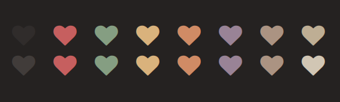

## paper

<p align="center">A colorscheme dominated by brownish colors.</p>

<p align="center"><p>


### installation

#### vim

- packer

```lua
use {
	"yrwq/paper",
	config = function()
	    require("paper")
	end,
}
```
